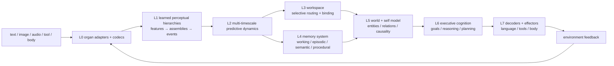

# Seed — runtime for the Taiji Native Cognitive Architecture

Seed is the project, product and runtime that trains, evaluates, deploys and hosts **Taiji** —
a native cognitive architecture being built from online predictive-coding mechanisms, not from
a Transformer wrapper. The kernel learns from **local prediction errors** (no backpropagation,
no attention matrix, no context window, no teacher model at runtime); beyond the kernel, Taiji
owns its own representations, persistent state, memory, goals, planning and action selection,
while deliberately reusing mature algorithms (embeddings, SSMs, MoE-style routing, optimizers,
retrieval) where they fit.

For the non-hype picture: the executable today is the **Taiji Substrate Kernel v8 (TSK-v8)** —
a byte-level predictive-coding research kernel. It is a working substrate, not yet a completed
cognitive architecture: built-in capabilities are verified; language-level intelligence is still
being trained (see [Status](#status)).

## Language / 语言

- **简体中文**：请阅读 [README.zh-CN.md](README.zh-CN.md)——中文项目介绍，与英文版逐条一致
- **English**: continue below

[](LICENSE)
[](https://www.python.org/)
[](.github/workflows/ci.yml)

## The architecture

### What Taiji is

Taiji targets a **complete native cognitive architecture** (contract: [Taiji Native Architecture v1](plans/active/TAIJI_NATIVE_ARCHITECTURE_V1.md), requirements: [Taiji Core Requirements](plans/active/TAIJI_CORE_REQUIREMENTS.md)):

- **One cognitive subject.** Taiji owns the cognitive state and decision path end to end. No
  Transformer hidden state, teacher logits or external model thinks for it at runtime; Seed is
  the hosting/product runtime, external models/tools are environment facilities.
- **Persistent, multi-timescale state** instead of restarting per request — sensory, working,
  episodic, semantic, procedural and developmental scales.
- **Body → real causal outcome.** Observations become internal `PerceptEvent`s; actions are
  `ActionIntent → WorldAction` that change the environment; the real `Outcome` feeds back into
  world calibration, memory writes, credit and learning.
- **Heterogeneous specialization instead of one huge homogeneous net.** Groups of neurons with
  different receptive fields, timescales and learning rules cooperate; the bar is a pre-registered
  task only the *combination* can solve (`1 + 1 > 2`).
- **Reuses the toolbox, owns the mind.** Learned embeddings, SSM blocks, attention-as-routing,
  MoE-style experts, optimizers and retrieval are allowed as mechanisms — the invariant is that
  Taiji's continuous state, memory, goals and decisions remain Taiji-owned, saveable, lesionalble
  and replaceable.

### Layer overview



A cross-cutting **homeostatic / developmental regulation** system drives curiosity, fatigue,
stress, sleep/play and structural budget from internal state — not from a UI scheduler.

### Memory and cognition contracts

Taiji's state is versioned and observable: `PerceptState`, `PredictiveState`,
`WorkspaceState`, `WorldState`, `MemoryState`, `GoalState`, `PlanState`, `SelfState`,
`HomeostaticState`, `DevelopmentState`, `LearningState`. The memory system is multi-system —
**working** (current variables), **episodic** (one-shot real experience), **semantic**
(stable concepts distilled across experiences) and **procedural** (skills) — not a context
window, a KV cache, a RAG hit, or a Python list.

### Learning: two planes

1. **Developmental training** — batch offline formation of perceptual hierarchies, world
   model, semantic memory and language organs. When it uses optimizers/distillation they are
   explicitly marked `native-assisted`; the native kernel meanwhile runs its own local delta
   rules (no `backward()` anywhere in `taiji/` since 2026-08-26).
2. **Lifetime learning** — runtime adaptation through local prediction errors, eligibility
   traces, reward/novelty modulation, episodic write, replay and structural plasticity, without
   catastrophic forgetting.

### The current executable kernel (TSK-v8)

`taiji/` today runs the substrate kernel: raw-byte codec + predictive fabric + distributed
episodic field prototype + byte motor, wired into one observable, checkpointable loop with no
Transformer and with PyTorch used only as a tensor engine. Updates are restricted to fixed
fixed-fan-in edges — no dense structural mask, no attention matrix, no context window, no
optimizer, no `backward()`:

```math
u_t^r = \mathrm{Bound}\left(\lambda_u u_{t-1}^r + \alpha_g (D^r)^T e_{t-1}^{r} + \alpha_T \hat a_t^r + \alpha_c c_t^r\right)
```

```math
\Delta D^r=\eta_D\, e_{t-1}^{r}(q_{t-1}^r)^T, \qquad
\Delta T^r=\eta_T\,(a_t^r-T^r q_{t-1}^r)(q_{t-1}^r)^T
```

Episodic storage is a shared distributed field: writing an event excites one overlapping
engram population `h` — no row, key or value is appended:

```math
h^{event}=\phi(Qs+\gamma_e(Aa+Oo+r\rho+Tt+Ee+Pp)), \qquad
\Delta W^{mem}=\eta_m g(h^{event}-W^{mem}h^{cue})(h^{cue})^T
```

(Tensor shapes, update order and state contract: [TSK-v8 spec](plans/archive/implementation/TAIJI_SUBSTRATE_KERNEL_V8_SPEC.md).)

## Capabilities

The project has an **adversarial verification culture**: every capability below is measured by
committed, lesion-controlled harnesses — fixed seeds, explicit baselines (random / frozen
parent / simple rule / hash-only), read-only holdout+retention, fresh-process checkpoint
re-execution with digest comparison, and explicit `failed` verdicts where they apply. The
[M0 five-ability contract](plans/manifests/taiji_foundation_baseline_v1.json) fixes what counts.

### Verified kernel mechanisms (reproducible, committed)

| Capability | Result |
|---|---:|
| Online byte-cycle prediction (no backprop) | 0% → **94.12%** accuracy; mean surprise −98.02% |
| Free generation | `a → bcdabcda`, all 8 steps exact |
| Ambiguity resolution (N7) | 100% vs 50% for a first-order model |
| Delay / trace memory (N8) | trace-only 100%; removing trace or dynamic state → 50% |
| Teacher-free long free-run (N9) | 128 actions, all exact |
| Sparse migration (N10) | ≤ 2.98e-8 forward diff vs dense; 98.59% storage |
| Action credit (N11) | 100% vs 50% random, 57.5% without action learning |
| Episodic field, one-shot (M5) | 8 episodes in one shared field, zero per-event slots; recall 87.5% vs 25% controls |

### Structural growth and collaboration (gated)

- Region **growth / split / merge / prune** and connection pruning pass holdout, budget, trial
  roundtrip and reverse-rollback gates; proposals come from real predictive-error/resource
  signals in the runtime tick, never from pre-written intent tables.
- A **cross-region cooperation learner** selects explicit inter-region connections by measured
  prediction-error transfer and resource state (3-seed gated).

### Capability gates A0–A9 (the contract for "smart")

Each gate must prove the mechanism on *unseen* data against explicit baselines; none is passed
by training scores (definitions in the [architecture contract](plans/active/TAIJI_NATIVE_ARCHITECTURE_V1.md#11-能力反证门槛)):

| Gate | Must prove | Progress |
|---|---|---|
| A0 ownership | Taiji completes a cognitive slice without Seed decision logic | contract + slice closed |
| A1 learned abstraction | variable-duration assemblies transfer to unseen combinations | relation subgate closed; full assembly open |
| A2 world state | entity/event persistence + predicts intervention outcomes | narrow world gates closed |
| A3 adaptive collaboration | heterogeneous groups out-perform any single group | workspace basics; full gate open |
| A4 episodic → semantic | concepts transfer, not episode copy | prototype + runtime ownership; consolidation open |
| A5 homeostatic regulation | drives exploration/learning/sleep, not UI numbers | prototypes gated; breadth open |
| A6 goals & planning | imagined rollout improves real success | single-step planning gates closed |
| A7 native generation | internal intent → readable language/tool actions | structured generation closed; fluency in training |
| A8 continual evolution | old abilities survive; gated growth/prune | growth gates closed; B5 under training |
| A9 embodiment | organs share world state; cross-modal transfer | contracts exist; full gate open |

### Unified ability evaluation (M0) and current training (M1)

M0 built the **measurement machine** and a trusted zero point (`status=failed` by design):

- B1 byte/compositional prediction — not yet better than a unigram baseline at 1 MiB scale.
- B2 delayed memory — recall exists but shows no causal gain over the memory-lesion arm.
- B3 world transition / B4 goal-driven action — task-level signals passed at pilot scale
  (world error → ~1e-5, goal success 0.5 → 1.0), not yet foundation-scale.
- B5 continual learning — continuation verified; backward transfer still negative.

M1 then trains this loop on CPU (courses F1→F5, three fixed seeds, content-addressed data,
atomic `parent/last/best` checkpoints, fresh-process read-only re-evaluation). F1 byte
prediction dropped holdout BPB ≈ 30% at 1 MiB scale; F3 world/action courses reached their
stage gates; the **memory course is the current frontier**: the native association substrate
was judged unsuitable by its own data contract, a first-class **identity key/value organ** was
promoted to default-on (15/15 gates), and a foundation-scale judgment then showed the organ's
addressing still fails under interference — three falsification probes pinned the root cause;
the fix is under construction (M1-65). Reports are under `reports/` with a matching plan entry:
[the single execution plan](plans/active/roadmap/03_CURRENT_EXECUTION.md).

## Status

- Completed and committed: substrate kernel + verification chain (900+ tests), structural
  growth gates, M0 measurement machine, M1 training pipeline (F1–F5, three seeds), memory data
  contract and identity organ v2 as a default-on trainable organ.
- In progress: M1-65 (interference-surviving memory addressing) — the one current next step.
- Honest boundary: this is a learning-mechanism prototype under training, **not** a completed
  cognitive architecture, not a language model, and not a claim about AGI. Garbled replies are
  expected kernel behavior.

## Quick start

```bash
python -m pip install -e ".[dev]"
python scripts/training/verify_taiji_native_v7.py        # substrate regression chain
python -m pytest tests -q                                # 900+ committed tests
```

Seed runtime compatibility API:

```python
from seed import Seed

model = Seed()
model.learn_bytes(b"abcdabcdabcdabcd", epochs=200)

print(model.score_bytes(b"abcdabcdabcdabcd"))
print(model.generate(b"a", length=8))

checkpoint = model.checkpoint()
restored = Seed.from_checkpoint(checkpoint)
```

Training entry points (CPU): `scripts/training/train_taiji_foundation.py`,
`train_taiji_memory.py`, `train_taiji_world_action.py`, `train_taiji_joint.py`.

## Product shell

Seed ships as a self-contained Windows desktop build (dual-entry `Seed.exe` +
`SeedBackend.exe`): double-click launches the backend, activates the native runtime and serves
the web UI on `http://127.0.0.1:8000` — chat, training dashboard, lifecycle dashboard, IDE
workspace and agent configuration within a few seconds. Development mode:

```bash
python -m uvicorn api.app:app --host 127.0.0.1 --port 8000   # backend + web UI
python desktop/main.py                                       # desktop shell
cd frontend && npm run dev                                   # frontend dev server
```

Environment knobs: `SEED_PORT` (default 8000), `SEED_HOST` (default 127.0.0.1),
`SEED_RUNTIME=1` (activate the Seed native runtime on startup). Historical beta evidence in
`reports/seed_public_beta_release_20260823.md`.

## Source layout

```text
taiji/                  native cognitive architecture (imports no seed/neuroplex/transformers)
├── fabric.py           predictive recurrent tick
├── sparse.py           fixed fan-in synapses, local updates
├── memory.py           distributed episodic encoding / completion / readback
├── identity_organ.py   first-class trainable key/value memory organ
├── organs.py           raw-byte sensor, sparse receptor bank, reward-aware motor
├── foundation_tasks.py B1–B5 ability adapters (M0 contract)
├── foundation_training.py  joint F1–F5 training, checkpoints, lineage
└── model.py            observe / learn / score / generate / checkpoint

scripts/training/       verify_* chain, train_taiji_* entries, eval_taiji_m1_*
tests/taiji_native/     kernel regression + ownership contracts
reports/                numbered, committed evidence per milestone
plans/active/           core requirements · architecture v1 · single execution plan
```

## License

Apache License 2.0. See [LICENSE](LICENSE).