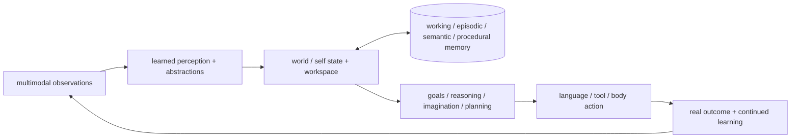

# Seed — runtime for the Taiji Native Cognitive Architecture

A byte-level predictive-coding kernel that learns **online from local prediction errors** — no
backpropagation, no attention matrix, no context window, no teacher model. Sparse fixed-fan-in
synapses carry every update, and episodic memory is a shared distributed field that allocates
**zero slots per event**.

What makes this project different is not the ambition — it is the **verification discipline**.
Every number in this README comes from committed, lesion-controlled harnesses that run fixed
seeds against explicit baselines (random / frozen parent / simple rule / hash-only), keep
holdout and retention read-only, re-open the checkpoint in a **fresh process**, and compare
content digests. Failures are reported as failures.

中文版介绍：[README.zh-CN.md](README.zh-CN.md)（Chinese introduction）

[](LICENSE)
[](https://www.python.org/)
[](.github/workflows/ci.yml)

## Status — stated plainly

Latest work: **2026-09-03 · 1044 commits · M0 completed, M1 in progress (M1-65)**.

| Stage | Verdict |
|---|---|
| Substrate kernel (TSK-v8) | reproducible: byte-cycle accuracy **0% → 94.12%**, surprise **−98.02%**, free generation exact, seed-fixed and committed |
| M0 five-ability baseline | **completed and trusted as a zero point** — the measurement chain works end-to-end (checkpoint preflight passes, all controls wired); **none of the five abilities is yet proven** — each is recorded as `failed` where it failed |
| M1 foundation training pipeline | built and running: F1–F5 courses, three seeds, content-addressed data partitions, `parent/last/best` atomic checkpoints, fresh-process read-only evaluation |
| M1 memory | identity organ v2 promoted to a **first-class trainable key/value memory organ** (15/15 gates) — then **foundation-scale B2 judged honestly: memory ability not yet established**; root cause located (addressing key lost under interference); acceptance probe committed, currently red, fix under construction |

The architecture direction is unchanged: **Taiji is a native cognitive architecture, not a
Transformer wrapper** (it imports neither `transformers` nor the legacy `neuroplex` runtime;
PyTorch is used only as a tensor execution engine). The current model is a
**learning-mechanism prototype** — not a completed cognitive architecture, not a language
model, and not a claim about AGI. Garbled text replies are expected kernel behavior.

## Why you can trust the numbers

1. **Every claim has a lesion control.** A result only counts if removing the mechanism in
   question (memory, action credit, trace, identity organ) makes the score collapse — and those
   lesion arms are part of the committed harness, not an afterthought.
2. **The harness cannot cheat for the model.** Holdout/retention partitions are byte-identical
   between training report and an independent re-opening process (`holdout_updates = 0`,
   `checkpoint_read_only = true`, digest match). A permutation null distribution guards against
   accidental shortcuts in the curriculum itself.
3. **Failures are part of the product.** The ledger records the honest verdicts: a foundation
   baseline that is trusted-but-failing (`can_promote = false`), a candidate memory substrate
   that was *judged unsuitable and rejected* by its own data contract, and a promoted organ
   that a larger-scale judgment later showed to be insufficient — with **three sequential
   counter-falsification probes** that pinned the mechanism, not the hyperparameters.
4. **Single-source governance.** `plans/active/roadmap/03_CURRENT_EXECUTION.md` is the only
   execution plan and the only "next step" authority; historical plan numbers are migration
   labels only. Every milestone in this README can be traced to a numbered report in
   `reports/` with a matching JSON.

## Architecture at a glance



The invariant: **Taiji owns the cognitive state and decision path.** Neither qwen/provider as
teacher, nor any Transformer, Legacy runtime, or Skill/MCP artifact may become the runtime
cognitive subject. Mature algorithms (optimizers, embeddings, distillation) are only reused
where they fit, under provenance constraints and holdout isolation — "standing on the
shoulders of giants" with a double boundary, not a transplant.

## What a Transformer does — what this kernel does instead

| Transformer | Taiji native kernel |
|---|---|
| tokenizer + learned embedding | 256 raw-byte receptors + boundary receptor |
| self-attention | sparse reciprocal prediction and recurrent transitions |
| KV cache / external retrieval | one shared engram field, no per-event K/V slots |
| global backpropagation | local prediction/state/motor/memory deltas |
| autoregressive decode | motor byte fed back through the same sensor |

## Verified results

### Substrate kernel (TSK-v8) — reproducible, committed

Measured on the committed two-region `[64, 48]` byte-cycle benchmark (seed `7`):

| Metric | Result |
|---|---:|
| active learned parameters | 83,841 |
| byte-cycle accuracy | 0% → 94.12% |
| mean surprise | 5.4041 → 0.1069 (**−98.02%**) |
| free generation | `a → bcdabcda` (all eight steps correct) |
| sparse vs dense forward diff | ≤ 2.98e-8 (N10); storage 98.59% of dense-equivalent |
| N7 ambiguous stream | full model 100% vs first-order 50% |
| N8 delayed trace | trace-only 100%; removing trace or dynamic state → 50% |
| N9 free run | 128 motor actions, no teacher forcing, all exact |
| N11 action credit | 100% vs 50% random, 57.5% without action learning |
| M5 episodic field | 8 one-shot episodes, zero per-event slots; action recall 87.5% vs 25% controls |

Mechanism-level decisions read the M6 **seed panel** (12 seeds) rather than a single run, and a
baseline is re-executed from a clean worktree instead of being read out of a committed report.

### M0 — a trusted zero point (five abilities, honest failures)

M0 built the measurement machine, not the capabilities (overall `status = failed`,
`can_promote = false` — by design). The delivery is that this verdict is now *trustworthy*:

- **Checkpoint preflight passes**: save → close process → restore in a fresh interpreter →
  identical next-step prediction and digest → save child again (report `taiji_m0_checkpoint_preflight`).
- **A frozen contract**: `plans/manifests/taiji_foundation_baseline_v1.json` fixes five
  abilities, four control kinds, three seeds, four partitions, sample minima, and read-only
  holdout rules. Leakage or side-effect tests had to fail first before the evaluator existed.
- **B1 sequence prediction** — `failed`: worst seed 6.497 BPB vs unigram 5.942, on a real
  Chinese corpus (`1,048,576` train / `131,072` holdout / `131,072` retention).
- **B2 delayed memory** — `failed`: 0.75 did not exceed the memory-lesion arm; no attributable
  causal gain.
- **B3 transition / B4 action credit** — task-level signals passed but at smoke sample sizes;
  not promotable to foundation scale.
- **B5 continual learning** — `failed`: worst backward transfer −0.244; phase-B continuation
  itself is verified working (no hidden re-initialization).

With the zero point trusted, the plan deliberately stops expanding the periphery (plugins, UI,
gates) and uses the failing curves to drive the training curriculum.

### M1 — first real joint training, three seeds

A full foundation pipeline with a **course split F1 (perception) → F2 (memory) → F3
(world/action) → F4 (joint) → F5 (promotion)**, all in one checkpoint lineage:

- **F1 byte prediction**: holdout BPB per seed `9.063→6.384`, `8.738→6.395`, `9.397→6.246`
  (pilot), then full-coverage at `1,048,576` bytes → `5.3649→4.8648` etc.
- **F3 world/action**: world error `1.8871 → ~1e-5`; goal success `0.5 → 1.0`; ablating
  outcome credit drops it back to `0.5`.
- **F4 joint training**: all four objectives trained to one checkpoint — sequence BPB
  `8.0056 → ~5.2`, memory recall `0.5 → 0.63+`, world error → `~1e-5`, goal success `1.0`,
  with retention improving in sync.
- The harness found and fixed a real restore bug: a 1-ulp float32 rounding edge in
  `SparseSynapses.load_payload()` was silently rewriting weights on recovery; a tolerance
  idempotency boundary and regression test now lock it down (commit `ab4b079`).
- Full-coverage promotion audit: three seeds, `1,048,576 / 1,000 / 1,000 / 1,000` samples,
  training report and independent eval-only **byte-identical** on every metric and checkpoint
  digest — and honest `blocked` verdicts when memory regressed.

Two-timescale learning policy (kept honest, not dogmatic): during development epochs, the
trainer may attach mature optimizers/distillation to *differentiable* modules; at runtime,
synapses keep local prediction-error learning. Both write the same versioned checkpoint but
can be lesioned independently.

### M1 memory — an organ that got promoted, then honestly re-judged

- The **native episodic association** was first judged *unsuitable as a training substrate*:
  a data contract (`MemoryLearningExample`: stable `cue_key` → independent `action`/`outcome`
  values, per-partition provenance audit) showed negative row-wise binding margins and a
  negative control that reacted identically (`reports/taiji_m1_62_*`).
- The **identity organ v2** was then promoted to a first-class, default-on trainable key/value
  memory organ (15/15 gates; reward-modulated three-factor write; parameters
  `171,561 → 311,081` with the `+139,520` organ share registered in the budget, not hidden).
  Flipping the default exposed four real defects that were fixed and recorded — including a
  **reward-blind write** that would have bound wrong actions as strongly as correct ones.
- Foundation-scale B2 at the manifest minimum (`1,000/200/200`, ~2,809 CPU-seconds across
  three seeds) then produced the honest judgment: **memory ability is not yet established**.
  Lesion-identity scored bitwise-identical to full Taiji on all three seeds; the read path was
  statistically indistinguishable from "nothing was ever written" — and a permutation null
  proved the curriculum has no shortcut.
- **Three sequential counter-falsification probes** pinned the root cause: capacity is *not*
  the issue (128 → 4096 slots changes nothing, bitwise-identical); course difficulty is *not*
  the issue (one interference symbol suffices to break addressing); the issue is **addressing
  key loss under interference** — the write basis and the post-interference read basis have
  cosine `≈ 0.098` while the match threshold is `0.9`, because the organ addresses the memory
  by the fabric's *transient activity state*, which interference destroys.
- The one-step answer (M1-65) is already fixed in stone: an **acceptance probe committed as a
  permanent test** asserts "write basis vs read basis cosine ≥ threshold after ≥ 1
  interference symbol" — red today (`min 0.047`), and the mechanism has to turn it green before
  the same B2 evaluator is re-run unchanged. This decouples "fixable addressing" from "fancy
  accuracy", so a small-course pass can never masquerade as a foundation-scale win again.

## Project scope

**Taiji** is the native cognitive architecture and model. **Seed** is the project, product and
runtime that trains, evaluates, deploys and hosts Taiji. Taiji is being redesigned around
learned perception, world state, workspace, memory, goals, reasoning, planning and generation
while reusing mature algorithms where they fit — not rebuilding intelligence from primitive
one-hot mechanisms.

## Naming

| Name | Meaning |
|---|---|
| **Seed** | project, product, distribution and runtime; package `seed` |
| **Taiji** | complete native cognitive architecture and model; target package `taiji/` |
| **TSK-v8** | current executable byte/fabric/memory/motor research kernel and compatibility line |
| **Legacy NeuroPlex** | the frozen Transformer baseline in `neuroplex/`; retained only for reproducibility and same-budget comparison; never imported by Taiji |

## Quick start

```bash
python -m pip install -e ".[dev]"
python scripts/training/verify_taiji_native_v7.py        # substrate regression chain
python -m pytest tests -q                                # 900+ committed tests
```

Seed runtime compatibility API:

```python
from seed import Seed

model = Seed()
model.learn_bytes(b"abcdabcdabcdabcd", epochs=200)

print(model.score_bytes(b"abcdabcdabcdabcd"))
print(model.generate(b"a", length=8))

checkpoint = model.checkpoint()
restored = Seed.from_checkpoint(checkpoint)
```

Training entry points (M1, CPU): `scripts/training/train_taiji_foundation.py`,
`train_taiji_memory.py`, `train_taiji_world_action.py`, `train_taiji_joint.py`
(see `plans/active/roadmap/03_CURRENT_EXECUTION.md` §6 — the single authority for the
current curriculum and the one next step).

## Product shell

Seed ships as a self-contained Windows desktop build (dual-entry `Seed.exe` +
`SeedBackend.exe`): double-click launches the backend, activates the native runtime, and serves
the web UI on `http://127.0.0.1:8000` — chat, training dashboard, lifecycle dashboard, IDE
workspace and agent configuration are typically reachable within a few seconds. Development
mode:

```bash
python -m uvicorn api.app:app --host 127.0.0.1 --port 8000   # backend + web UI (serves frontend/dist)
python desktop/main.py                                         # desktop shell (window + backend + WebSocket 8765)
cd frontend && npm run dev                                     # frontend dev server
```

Environment knobs: `SEED_PORT` (default 8000), `SEED_HOST` (default 127.0.0.1),
`SEED_RUNTIME=1` (activate the Seed native runtime on startup). Historical beta evidence lives
in `reports/seed_public_beta_release_20260823.md` and `reports/`.

The product shell documents the *runtime*, not the capability: the UI is deliberately not
allowed to overstate the model (visual polish must express only real state). Capability is
being built model-first, below.

## Reproducibility & evidence rules

- Fixed seed sets (default `[11, 29, 47]`, 12-seed panels for mechanism decisions); a single
  favorable seed never promotes.
- Evaluators touch no provider, frontend, MCP executor or training interface during evaluation;
  holdout/retention updates are asserted `= 0`.
- Every promoted artifact keeps a parent/child lineage, content-digest genealogy, parameter
  budget you can audit (planned = active), and a fresh-process read-only re-check.
- Historical checkpoints that serialized `taiji.*` names load through the scoped
  `neuroplex.legacy_checkpoint` compatibility utility; importing NeuroPlex no longer shadows
  the native `taiji` package. Legacy dependencies are installed only when reproducing that
  baseline: `python -m pip install -e ".[legacy]"`.

## Source layout

```text
taiji/                      native cognitive architecture (imports no seed/neuroplex/transformers)
├── fabric.py               predictive recurrent tick
├── sparse.py               fixed fan-in synapses and local updates
├── memory.py               distributed episodic encoding, completion, readback
├── identity_organ.py       first-class key/value memory organ (default-on after M1-63)
├── organs.py               raw-byte sensor, sparse receptor bank, reward-aware motor
├── foundation_tasks.py     B1–B5 ability adapters (M0 contract)
├── foundation_training.py  joint F1–F5 training runs, checkpoints, lineage
└── model.py                observe, learn, score, generate, checkpoint

scripts/training/           verify_* regression chain, train_taiji_* entry points, eval_taiji_m1_*
tests/taiji_native/         kernel regression and ownership contracts (900+ tests repo-wide)
plans/active/roadmap/03_CURRENT_EXECUTION.md    the single execution plan and next-step authority
reports/                    numbered, committed evidence per milestone
```

## License

Apache License 2.0. See [LICENSE](LICENSE).