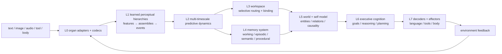

# Seed — runtime for the Taiji Native Cognitive Architecture

Seed provides the project, product and runtime that trains, evaluates, deploys and hosts **Taiji** —
a native cognitive architecture being built from online predictive-coding mechanisms, not from
a Transformer wrapper. The kernel learns from **local prediction errors** (no backpropagation,
no attention matrix, no context window, no teacher model at runtime); beyond the kernel, Taiji
owns its own representations, persistent state, memory, goals, planning and action selection,
while deliberately reusing mature algorithms (embeddings, SSMs, MoE-style routing, optimizers, retrieval) where they fit. A key capability the architecture is designed for is **self-evolution** — to revise, grow and reorganize its own structure as it learns (see [Structural growth and collaboration](#structural-growth-and-collaboration--the-self-evolution-capability)).

For the non-hype picture: the repository contains both the **Seed product shell** and the
**Taiji research runtime**. The lowest-level executable substrate is the **Taiji Substrate
Kernel v8 (TSK-v8)**, while the current M5 work evaluates a content-addressed K-axis learning
and selection track on top of Taiji state and workbench contracts. These are working research
systems, not a completed cognitive architecture or a released general-purpose model (see
[Status](#status)).

## Language / 语言

- **简体中文**：请阅读 [README.zh-CN.md](README.zh-CN.md)——中文项目介绍，与英文版逐条一致
- **English**: continue below

[](LICENSE)
[](https://www.python.org/)
[](.github/workflows/ci.yml)

## The architecture

### What Taiji is

Taiji targets a **complete native cognitive architecture** (contract: [Taiji Native Architecture v1](plans/active/TAIJI_NATIVE_ARCHITECTURE_V1.md), requirements: [Taiji Core Requirements](plans/active/TAIJI_CORE_REQUIREMENTS.md)):

- **One cognitive subject.** Taiji owns the cognitive state and decision path end to end. No
  Transformer hidden state, teacher logits or external model thinks for it at runtime; Seed is
  the hosting/product runtime, external models/tools are environment facilities.
- **Persistent, multi-timescale state** instead of restarting per request — sensory, working,
  episodic, semantic, procedural and developmental scales.
- **Body → real causal outcome.** Observations become internal `PerceptEvent`s; actions are
  `ActionIntent → WorldAction` that change the environment; the real `Outcome` feeds back into
  world calibration, memory writes, credit and learning.
- **Heterogeneous specialization instead of one huge homogeneous net.** Groups of neurons with
  different receptive fields, timescales and learning rules cooperate; the bar is a pre-registered
  task only the *combination* can solve (`1 + 1 > 2`).
- **Reuses the toolbox, owns the mind.** Learned embeddings, SSM blocks, attention-as-routing,
  MoE-style experts, optimizers and retrieval are allowed as mechanisms — the invariant is that
  Taiji's continuous state, memory, goals and decisions remain Taiji-owned, saveable, lesionalble
  and replaceable.

### Layer overview



A cross-cutting **homeostatic / developmental regulation** system drives curiosity, fatigue,
stress, sleep/play and structural budget from internal state — not from a UI scheduler.

### Memory and cognition contracts

Taiji's state is versioned and observable: `PerceptState`, `PredictiveState`,
`WorkspaceState`, `WorldState`, `MemoryState`, `GoalState`, `PlanState`, `SelfState`,
`HomeostaticState`, `DevelopmentState`, `LearningState`. The memory system is multi-system —
**working** (current variables), **episodic** (one-shot real experience), **semantic**
(stable concepts distilled across experiences) and **procedural** (skills) — not a context
window, a KV cache, a RAG hit, or a Python list.

### Learning: two planes

1. **Developmental training** — batch offline formation of perceptual hierarchies, world
   model, semantic memory and language organs. When it uses optimizers/distillation they are
   explicitly marked `native-assisted`; the native kernel meanwhile runs its own local delta
   rules (no `backward()` anywhere in `taiji/` since 2026-08-26).
2. **Lifetime learning** — runtime adaptation through local prediction errors, eligibility
   traces, reward/novelty modulation, episodic write, replay and structural plasticity, without
   catastrophic forgetting.

### The current executable kernel (TSK-v8)

`taiji/` today runs the substrate kernel: raw-byte codec + predictive fabric + distributed
episodic field prototype + byte motor, wired into one observable, checkpointable loop with no
Transformer and with PyTorch used only as a tensor engine. Updates are restricted to fixed
fixed-fan-in edges — no dense structural mask, no attention matrix, no context window, no
optimizer, no `backward()`:

```math
u_t^r = \mathrm{Bound}\left(\lambda_u u_{t-1}^r + \alpha_g (D^r)^T e_{t-1}^{r} + \alpha_T \hat a_t^r + \alpha_c c_t^r\right)
```

```math
\Delta D^r=\eta_D\, e_{t-1}^{r}(q_{t-1}^r)^T, \qquad
\Delta T^r=\eta_T\,(a_t^r-T^r q_{t-1}^r)(q_{t-1}^r)^T
```

Episodic storage is a shared distributed field: writing an event excites one overlapping
engram population `h` — no row, key or value is appended:

```math
h^{event}=\phi(Qs+\gamma_e(Aa+Oo+r\rho+Tt+Ee+Pp)), \qquad
\Delta W^{mem}=\eta_m g(h^{event}-W^{mem}h^{cue})(h^{cue})^T
```

(Tensor shapes, update order and state contract: [TSK-v8 spec](plans/archive/implementation/TAIJI_SUBSTRATE_KERNEL_V8_SPEC.md).)

## Capabilities

The project has an **adversarial verification culture**: every capability below is measured by
committed, lesion-controlled harnesses — fixed seeds, explicit baselines (random / frozen
parent / simple rule / hash-only), read-only holdout+retention, fresh-process checkpoint
re-execution with digest comparison, and explicit `failed` verdicts where they apply. The
[M0 five-ability contract](plans/manifests/taiji_foundation_baseline_v1.json) fixes what counts.

### Verified kernel mechanisms (reproducible, committed)

| Capability | Result |
|---|---:|
| Online byte-cycle prediction (no backprop) | 0% → **94.12%** accuracy; mean surprise −98.02% |
| Free generation | `a → bcdabcda`, all 8 steps exact |
| Ambiguity resolution (N7) | 100% vs 50% for a first-order model |
| Delay / trace memory (N8) | trace-only 100%; removing trace or dynamic state → 50% |
| Teacher-free long free-run (N9) | 128 actions, all exact |
| Sparse migration (N10) | ≤ 2.98e-8 forward diff vs dense; 98.59% storage |
| Action credit (N11) | 100% vs 50% random, 57.5% without action learning |
| Episodic field, one-shot (M5) | 8 episodes in one shared field, zero per-event slots; recall 87.5% vs 25% controls |

### Structural growth and collaboration — the self-evolution capability

The architecture is designed to revise its own structure (CR-4). The executable seeds, gated like every claim:

- Region **growth / split / merge / prune** and connection pruning pass holdout, budget, trial
  roundtrip and reverse-rollback gates; proposals come from real predictive-error/resource
  signals in the runtime tick, never from pre-written intent tables.
- A **cross-region cooperation learner** selects explicit inter-region connections by measured
  prediction-error transfer and resource state (3-seed gated).

### Capability gates A0–A9 (the contract for "smart")

Each gate must prove the mechanism on *unseen* data against explicit baselines; none is passed
by training scores (definitions in the [architecture contract](plans/active/TAIJI_NATIVE_ARCHITECTURE_V1.md#11-能力反证门槛)):

| Gate | Must prove | Progress |
|---|---|---|
| A0 ownership | Taiji completes a cognitive slice without Seed decision logic | contract + slice closed |
| A1 learned abstraction | variable-duration assemblies transfer to unseen combinations | relation subgate closed; full assembly open |
| A2 world state | entity/event persistence + predicts intervention outcomes | narrow world gates closed |
| A3 adaptive collaboration | heterogeneous groups out-perform any single group | workspace basics; full gate open |
| A4 episodic → semantic | concepts transfer, not episode copy | prototype + runtime ownership; consolidation open |
| A5 homeostatic regulation | drives exploration/learning/sleep, not UI numbers | prototypes gated; breadth open |
| A6 goals & planning | imagined rollout improves real success | single-step planning gates closed |
| A7 native generation | internal intent → readable language/tool actions | structured generation closed; fluency in training |
| A8 continual evolution | old abilities survive; gated growth/prune | G-side course closed; K-worker course and runtime growth open |
| A9 embodiment | organs share world state; cross-modal transfer | contracts exist; full gate open |

### Historical baselines: M0–M2

M0 built the **measurement machine** and a trusted zero point (`status=failed` by design):

- B1 byte/compositional prediction — not yet better than a unigram baseline at 1 MiB scale.
- B2 delayed memory — recall exists but shows no causal gain over the memory-lesion arm.
- B3 world transition / B4 goal-driven action — task-level signals passed at pilot scale
  (world error → ~1e-5, goal success 0.5 → 1.0), not yet foundation-scale.
- B5 continual learning — continuation verified; backward transfer still negative.

M1 then trained this loop on CPU (courses F1→F5, three fixed seeds, content-addressed data,
atomic `parent/last/best` checkpoints, fresh-process read-only re-evaluation). The native
association substrate was judged unsuitable for foundation-scale delayed recall, so a
first-class **identity key/value organ** was promoted, then its address, verdict, and folded-key
value routes were separately falsified and closed. M1-66c is the resulting foundation B2 pass.

M2-0 completed the first real F1→F4 course on three seeds: delayed-memory recall rose to
`0.87/0.85/0.87`, world error fell to about `3.5e-08`, and goal success reached `1.0`. M2-1
then corrected a crucial measurement mistake: the apparent post-F2 F1 collapse was chiefly
long-term episodic feedback leaking into raw-byte language scoring, not evidence that F2 had
overwritten F1 weights. Raw-byte learning, scoring, and native generation now isolate memory by
default; the three existing child checkpoints, restored in fresh processes, score F1 holdout at
`4.826/4.931/4.805 BPB`, all below the `5.942` unigram baseline, while B2/B3/B4 remain unchanged.
These M0–M2 results remain the historical foundation baseline. The active execution has since
moved to the M5 K-axis track below; the full chronology and evidence links are maintained in
[the single execution plan](plans/active/roadmap/03_CURRENT_EXECUTION.md).

### Current research track: R2 native language capability

The current mainline is the R2 structured-language path: Taiji remains the native owner,
responses are trained through the native predictive readout, and every candidate is isolated,
checkpointable and evaluated on family-disjoint train/dev/final episodes. The repository has
not yet produced an L2 conversational model; the work below is the path toward one.

| Stage | Result |
|---|---|
| R2-D0/P0 | Structured episode boundaries, response-only native readout, atomic checkpointing and fresh-restore preflight are implemented |
| R2-H3.4 | UTF-8 and end-marker credit are stable, but unseen conditional response starts and continuations do not yet transfer |
| R2-H3.5-A | The signed-hash response-plan candidate was stopped before final: its target geometry did not transfer and the plan bridge could interfere with rendering |
| R2-H3.6 geometry | A no-training, three-seed audit selected train-whitened native response state + compositional character n-grams; this is a target-design result, not language ability |
| R2-H3.6-A | Versioned train-only target encoder, trainer integration and save/restore smoke passed on the 12/8/4 fixture; no capability training was performed |
| H3.6-B preflight | Control and treatment zero-step preflights passed at 276,610≤300,000 with parent/restore/target-lineage checks; `training_performed=false` |
| H3.6-B result | Six matched dev runs and three read-only bridge ablations completed; seed direction and non-proxy sequence gates failed, so final was not read and no more epochs are allowed |
| R2-H3.7 contract | Frozen 4-slot/48-wide/16-byte-phase factorized response workspace; byte error updates the bridge and current-slot credit |
| R2-H3.7 preflight | Control (273,890) and treatment (277,970) both passed committed-code preflight; `training_performed=false`, three-seed dev is now authorized |
| R2-H3.7 seed 20260917 | First matched dev pair completed; dev sequence criterion is 0.25/0.25 (control/treatment), and read-only ablation is 0.25/0.125/0.0 (normal/bridge/slot-credit); three-seed gate remains open |
| R2-H3.7 seed 20260918 | Second matched dev pair completed; dev sequence criterion remains 0.25/0.25 and read-only ablation is 0.25/0.25/0.25; aggregate remains pending the final seed |
| R2-H3.7 aggregate | [Three matched seeds and three read-only ablations](reports/taiji_r2_h3_7_matched_dev_result_20260917.json) completed; aggregate stopped before final because non-proxy direction was 0/0/0 and boundary/causal-ablation gates failed |

The authoritative execution order is the [current plan](plans/active/roadmap/03_CURRENT_EXECUTION.md),
with the H3.6 target contract in [M5_R2_H3_6_PLAN_TARGET_GEOMETRY_CONTRACT_20260916.md](plans/reference/M5_R2_H3_6_PLAN_TARGET_GEOMETRY_CONTRACT_20260916.md),
the matched-run preregistration in [M5_R2_H3_6B_MATCHED_RUN_PREREGISTRATION_20260916.md](plans/reference/M5_R2_H3_6B_MATCHED_RUN_PREREGISTRATION_20260916.md),
the latest plumbing evidence in [taiji_r2_h3_6_target_encoder_smoke_20260916.json](reports/taiji_r2_h3_6_target_encoder_smoke_20260916.json),
and the zero-step control/treatment evidence in [taiji_r2_h3_6b_control_preflight_20260916.json](reports/taiji_r2_h3_6b_control_preflight_20260916.json) and [taiji_r2_h3_6b_treatment_preflight_20260916.json](reports/taiji_r2_h3_6b_treatment_preflight_20260916.json). The H3.7 execution contract is [M5_R2_H3_7_FACTORIZED_RESPONSE_WORKSPACE_CONTRACT_20260917.md](plans/reference/M5_R2_H3_7_FACTORIZED_RESPONSE_WORKSPACE_CONTRACT_20260917.md), with committed-code preflight evidence in [taiji_r2_h3_7_control_preflight_20260917.json](reports/taiji_r2_h3_7_control_preflight_20260917.json) and [taiji_r2_h3_7_treatment_preflight_20260917.json](reports/taiji_r2_h3_7_treatment_preflight_20260917.json).

The M5 K-axis scorecard remains valid as a parallel, limited mechanism result; it is not the
current R2 language mainline and does not imply a default-runtime promotion.

## Status

- Completed and committed: the TSK-v8 substrate and regression chain, structural-growth
  mechanism gates, the M0–M2 foundation evidence, the limited M5 K-axis scorecard evidence,
  the R2-H3.6-A target-plumbing implementation, and the completed H3.7
  three-seed development/aggregate evidence described above.
- Current boundary: the native language route has structured training and recovery evidence,
  but no S2/L2 conversational capability has been established. `promotion_gate=false`,
  `can_promote=false`, and `growth_admitted=false` remain the honest K-axis boundary; no
  default-runtime owner or product rollout is implied.
- Next planned action: perform the bounded read-only H3.7 attribution review in the frozen order target sketch → slot phase schedule → bridge credit → renderer readout → native prefix representation → capacity/data. H3.6-B and H3.7 finals remain unread; no extra epochs, default adoption, or Mini acceptance follow this negative result.
- Honest boundary: this is a learning-mechanism research prototype, **not** a completed
  cognitive architecture, not yet a general-purpose language model, and not a claim about AGI.
  The current R2 work explicitly treats unreadable or non-transferring responses as failures to
  resolve, not as completed model capability.

## Quick start

```bash
python -m pip install -e ".[dev]"
python scripts/training/verify_taiji_native_v7.py        # substrate regression chain
python -m pytest tests -q                                # 1,194 Python tests currently collected
```

Seed runtime compatibility API:

```python
from seed import Seed

model = Seed()
model.learn_bytes(b"abcdabcdabcdabcd", epochs=200)

print(model.score_bytes(b"abcdabcdabcdabcd"))
print(model.generate(b"a", length=8))

checkpoint = model.checkpoint()
restored = Seed.from_checkpoint(checkpoint)
```

Historical foundation training entry points (CPU): `scripts/training/train_taiji_foundation.py`,
`train_taiji_memory.py`, `train_taiji_world_action.py`, `train_taiji_joint.py`.

The current M5 evidence runners live in `scripts/training/`: `eval_taiji_m5_k_p4_7_capacity_clean_test.py`
through `eval_taiji_m5_k_p4_13_promotion_course.py`. The read-only scorecard reducer is
`audit_taiji_m5_k_axis_scorecard_v4.py`; it writes a report only when given an explicit
`--report` path.

## Product shell

Seed ships as a self-contained Windows desktop build (dual-entry `Seed.exe` +
`SeedBackend.exe`): double-click launches the backend, activates the native runtime and serves
the web UI on `http://127.0.0.1:8000` — chat, training dashboard, lifecycle dashboard, IDE
workspace and agent configuration within a few seconds. For the backend install
`python -m pip install -e ".[dev,legacy]"`; to run the Qt desktop shell, add the `desktop`
extra. Development mode:

```bash
python -m uvicorn api.app:app --host 127.0.0.1 --port 8000   # backend + web UI
python desktop/main.py                                       # desktop shell
cd frontend && npm ci && npm run dev                         # frontend dev server
```

Environment knobs: `SEED_PORT` (default 8000), `SEED_HOST` (default 127.0.0.1),
`SEED_RUNTIME=1` (activate the Seed native runtime on startup). The frontend requires Node
20.19+ or 22.12+. Docker users can run `docker compose up --build`. Historical beta evidence
is in `reports/seed_public_beta_release_20260823.md`.

## Source layout

```text
taiji/                  native architecture, organs, memory, K workers and G selection/solver
seed/                   Seed compatibility API and runtime-facing model boundary
seed_platform/          checkpoint, lineage, workbench and product runtime services
api/                    FastAPI backend and training/workbench routes
frontend/               Vue product shell, contract checks, unit tests and E2E smoke tests
desktop/                Windows Qt shell and PyInstaller entrypoint
scripts/training/       verification, foundation training and M5 evidence runners
tests/                  Python regression, API, runtime and ownership-contract tests
reports/                committed, machine-readable evidence per milestone
plans/                  active plan, frozen manifests and preregistered research contracts
```

## License

Apache License 2.0. See [LICENSE](LICENSE).
