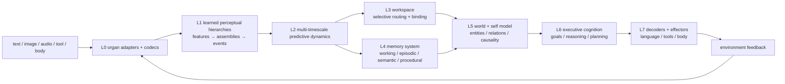

# Seed — Runtime for the Taiji Native Cognitive Architecture

Research evidence & ledger: [Current results and conclusions](plans/reference/PROJECT_RESULTS_AND_CONCLUSIONS_20260917.md), separating validated mechanisms, negative results, actual outputs, and unresolved capability gaps.

Milestone update (2026-09-28): **M5 bounded exit has been formally ratified** ([Exit Approval](plans/reference/M5_EXIT_APPROVAL_20260920.md)); project mainline is currently in **M6 Product Delivery** alongside the **R2/A-branch native language and inductive circuit investigations**. TSK-v8 serves as the native substrate kernel; the native predictive readout now incorporates positional input and UTF-8 evidence gating (`PLAN-A-26`), while the product copy circuit (`PLAN-A-28`) and identity router truncation (`PLAN-A-29`, reducing payload envelope 87.9 MB → 12.3 MB) have landed. The product shell has converged onto **Taiji Harness** with `taiji-local` zero-credential routing. See [03 Current Execution](plans/active/roadmap/03_CURRENT_EXECUTION.md) and [Plan Index](plans/active/PLAN_INDEX.md) for authoritative execution items.

Seed provides the project, product and runtime that trains, evaluates, deploys and hosts **Taiji** —
a native cognitive architecture being built from online predictive-coding mechanisms, not from
a Transformer wrapper. The kernel learns from **local prediction errors** (no backpropagation,
no attention matrix, no context window, no teacher model at runtime); beyond the kernel, Taiji
owns its own representations, persistent state, memory, goals, planning and action selection,
while deliberately reusing mature algorithms (embeddings, SSMs, MoE-style routing, optimizers, retrieval) where they fit. A key capability the architecture is designed for is **self-evolution** — to revise, grow and reorganize its own structure as it learns (see [Structural growth and collaboration](#structural-growth-and-collaboration--the-self-evolution-capability)).

For the non-hype picture: the repository contains both the **Seed product shell** and the
**Taiji research runtime**. The lowest-level executable substrate is the **Taiji Substrate
Kernel v8 (TSK-v8)**. While M5 bounded components are validated, general language dialog capability remains an active research challenge; model behavior is strictly separated from rule scaffolds (see [Status](#status)).

## Language / 语言

- **简体中文**：请阅读 [README.zh-CN.md](README.zh-CN.md)——中文项目介绍，与英文版逐条一致
- **English**: continue below

[](LICENSE)
[](https://www.python.org/)
[](.github/workflows/ci.yml)

## The architecture

### What Taiji is

Taiji targets a **complete native cognitive architecture** (contract: [Taiji Native Architecture v1](plans/active/TAIJI_NATIVE_ARCHITECTURE_V1.md), requirements: [Taiji Core Requirements](plans/active/TAIJI_CORE_REQUIREMENTS.md)):

- **One cognitive subject.** Taiji owns the cognitive state and decision path end to end. No
  Transformer hidden state, teacher logits or external model thinks for it at runtime; Seed is
  the hosting/product runtime, external models/tools are environment facilities.
- **Persistent, multi-timescale state** instead of restarting per request — sensory, working,
  episodic, semantic, procedural and developmental scales.
- **Body → real causal outcome.** Observations become internal `PerceptEvent`s; actions are
  `ActionIntent → WorldAction` that change the environment; the real `Outcome` feeds back into
  world calibration, memory writes, credit and learning.
- **Heterogeneous specialization instead of one huge homogeneous net.** Groups of neurons with
  different receptive fields, timescales and learning rules cooperate; the bar is a pre-registered
  task only the *combination* can solve (`1 + 1 > 2`).
- **Reuses the toolbox, owns the mind.** Learned embeddings, SSM blocks, attention-as-routing,
  MoE-style experts, optimizers and retrieval are allowed as mechanisms — the invariant is that
  Taiji's continuous state, memory, goals and decisions remain Taiji-owned, saveable, lesionalble
  and replaceable.

### Layer overview


```mermaid
flowchart LR
    obs[text / image / audio / tool / body] --> L0[L0 organ adapters + codecs]
    L0 --> L1[L1 learned perceptual hierarchies<br/>features → assemblies → events]
    L1 --> L2[L2 multi-timescale predictive dynamics]
    L2 --> L3[L3 workspace<br/>selective routing + binding]
    L2 --> L4[L4 memory system<br/>working / episodic / semantic / procedural]
    L3 --> L5[L5 world + self model<br/>entities / relations / causality]
    L4 --> L5
    L5 --> L6[L6 executive cognition<br/>goals / reasoning / planning]
    L6 --> L7[L7 decoders + effectors<br/>language / tools / body]
    L7 --> fb[environment feedback] --> L0
```

A cross-cutting **homeostatic / developmental regulation** system drives curiosity, fatigue,
stress, sleep/play and structural budget from internal state — not from a UI scheduler.

### Memory and cognition contracts

Taiji's state is versioned and observable: `PerceptState`, `PredictiveState`,
`WorkspaceState`, `WorldState`, `MemoryState`, `GoalState`, `PlanState`, `SelfState`,
`HomeostaticState`, `DevelopmentState`, `LearningState`. The memory system is multi-system —
**working** (current variables), **episodic** (one-shot real experience), **semantic**
(stable concepts distilled across experiences) and **procedural** (skills) — not a context
window, a KV cache, a RAG hit, or a Python list.

### Learning: two planes

1. **Developmental training** — batch offline formation of perceptual hierarchies, world
   model, semantic memory and language organs. Algorithms and supervision sources are disclosed
   separately: optimizers/autograd do not imply an external teacher. The substrate retains local
   delta rules; isolated sequence prototypes also use `backward()`, as allowed by the current architecture contract.
2. **Lifetime learning** — runtime adaptation through local prediction errors, eligibility
   traces, reward/novelty modulation, episodic write, replay and structural plasticity, without
   catastrophic forgetting.

### The current executable kernel (TSK-v8)

`taiji/` today runs the substrate kernel: raw-byte codec + predictive fabric + distributed
episodic field prototype + byte motor, wired into one observable, checkpointable loop with no
Transformer and with PyTorch used only as a tensor engine. Updates are restricted to fixed
fixed-fan-in edges — no dense structural mask, no attention matrix, no context window, no
optimizer, no `backward()`:

```math
u_t^r = \mathrm{Bound}\left(\lambda_u u_{t-1}^r + \alpha_g (D^r)^T e_{t-1}^{r} + \alpha_T \hat a_t^r + \alpha_c c_t^r\right)
```

```math
\Delta D^r=\eta_D\, e_{t-1}^{r}(q_{t-1}^r)^T, \qquad
\Delta T^r=\eta_T\,(a_t^r-T^r q_{t-1}^r)(q_{t-1}^r)^T
```

Episodic storage is a shared distributed field: writing an event excites one overlapping
engram population `h` — no row, key or value is appended:

```math
h^{event}=\phi(Qs+\gamma_e(Aa+Oo+r\rho+Tt+Ee+Pp)), \qquad
\Delta W^{mem}=\eta_m g(h^{event}-W^{mem}h^{cue})(h^{cue})^T
```

(Tensor shapes, update order and state contract: [TSK-v8 spec](plans/archive/implementation/TAIJI_SUBSTRATE_KERNEL_V8_SPEC.md).)

## Capabilities

The project has an **adversarial verification culture**: every capability below is measured by
committed, lesion-controlled harnesses — fixed seeds, explicit baselines (random / frozen
parent / simple rule / hash-only), read-only holdout+retention, fresh-process checkpoint
re-execution with digest comparison, and explicit `failed` verdicts where they apply. The
[M0 five-ability contract](plans/manifests/taiji_foundation_baseline_v1.json) fixes what counts.

### Verified kernel mechanisms (reproducible, committed)

| Capability | Result |
|---|---:|
| Online byte-cycle prediction (no backprop) | 0% → **94.12%** accuracy; mean surprise −98.02% |
| Free generation | `a → bcdabcda`, all 8 steps exact |
| Ambiguity resolution (N7) | 100% vs 50% for a first-order model |
| Delay / trace memory (N8) | trace-only 100%; removing trace or dynamic state → 50% |
| Teacher-free long free-run (N9) | 128 actions, all exact |
| Sparse migration (N10) | ≤ 2.98e-8 forward diff vs dense; 98.59% storage |
| Action credit (N11) | 100% vs 50% random, 57.5% without action learning |
| Episodic field, one-shot (M5) | 8 episodes in one shared field, zero per-event slots; recall 87.5% vs 25% controls |

### Structural growth and collaboration — the self-evolution capability

The architecture is designed to revise its own structure (CR-4). The executable seeds, gated like every claim:

- Region **growth / split / merge / prune** and connection pruning pass holdout, budget, trial
  roundtrip and reverse-rollback gates; proposals come from real predictive-error/resource
  signals in the runtime tick, never from pre-written intent tables.
- A **cross-region cooperation learner** selects explicit inter-region connections by measured
  prediction-error transfer and resource state (3-seed gated).

### Capability gates A0–A9 (the contract for "smart")

Each gate must prove the mechanism on *unseen* data against explicit baselines; none is passed
by training scores (definitions in the [architecture contract](plans/active/TAIJI_NATIVE_ARCHITECTURE_V1.md#11-能力反证门槛)):

| Gate | Must prove | Progress |
|---|---|---|
| A0 ownership | Taiji completes a cognitive slice without Seed decision logic | contract + slice closed |
| A1 learned abstraction | variable-duration assemblies transfer to unseen combinations | relation subgate closed; full assembly open |
| A2 world state | entity/event persistence + predicts intervention outcomes | narrow world gates closed |
| A3 adaptive collaboration | heterogeneous groups out-perform any single group | workspace basics; full gate open |
| A4 episodic → semantic | concepts transfer, not episode copy | prototype + runtime ownership; consolidation open |
| A5 homeostatic regulation | drives exploration/learning/sleep, not UI numbers | prototypes gated; breadth open |
| A6 goals & planning | imagined rollout improves real success | single-step planning gates closed |
| A7 native generation | internal intent → readable language/tool actions | structured generation closed; fluency in training |
| A8 continual evolution | old abilities survive; gated growth/prune | G-side course closed; K-worker course and runtime growth open |
| A9 embodiment | organs share world state; cross-modal transfer | contracts exist; full gate open |

### Historical baselines: M0–M2

M0 built the **measurement machine** and a trusted zero point (`status=failed` by design):

- B1 byte/compositional prediction — not yet better than a unigram baseline at 1 MiB scale.
- B2 delayed memory — recall exists but shows no causal gain over the memory-lesion arm.
- B3 world transition / B4 goal-driven action — task-level signals passed at pilot scale
  (world error → ~1e-5, goal success 0.5 → 1.0), not yet foundation-scale.
- B5 continual learning — continuation verified; backward transfer still negative.

M1 then trained this loop on CPU (courses F1→F5, three fixed seeds, content-addressed data,
atomic `parent/last/best` checkpoints, fresh-process read-only re-evaluation). The native
association substrate was judged unsuitable for foundation-scale delayed recall, so a
first-class **identity key/value organ** was promoted, then its address, verdict, and folded-key
value routes were separately falsified and closed. M1-66c is the resulting foundation B2 pass.

M2-0 completed the first real F1→F4 course on three seeds: delayed-memory recall rose to
`0.87/0.85/0.87`, world error fell to about `3.5e-08`, and goal success reached `1.0`. M2-1
then corrected a crucial measurement mistake: the apparent post-F2 F1 collapse was chiefly
long-term episodic feedback leaking into raw-byte language scoring, not evidence that F2 had
overwritten F1 weights. Raw-byte learning, scoring, and native generation now isolate memory by
default; the three existing child checkpoints, restored in fresh processes, score F1 holdout at
`4.826/4.931/4.805 BPB`, all below the `5.942` unigram baseline, while B2/B3/B4 remain unchanged.
These M0–M2 results remain the historical foundation baseline. The active execution has since
moved to the M5 K-axis track below; the full chronology and evidence links are maintained in
[the single execution plan](plans/active/roadmap/03_CURRENT_EXECUTION.md).

### Current research track: Native language capability & Inductive copy circuit

The current research mainline addresses the structural discrepancy between predictive coding and inductive copying/retrieval in multi-turn dialogues:

| Phase / Item | Core Finding & Validated Result |
|---|---|
| **M5 Bounded Exit** | Formally ratified on 2026-09-20. Four component axes (knowledge internalization, collaboration, somatic online loop, unified entry gate) passed. R2 conversational capability explicitly recorded as excluded debt. |
| **A2 Copy Circuit (A-Branch)** | Verified that raw predictive representations lack one-shot induction. Built dedicated copy circuit (`A2.1` write gate, `A2.2` content direct read, `A2.3` recall-conditioned emission, `A2.4` protocol gating). |
| **A2.5 UTF-8 Evidence Gating** | Added UTF-8 DFA positional gating to the copy circuit additive evidence (`PLAN-A-25`), eliminating out-of-boundary corruption and lifting product-entry recall to 28/104. |
| **PLAN-A-26 Positional Readout** | Integrated positional encoding into mainline training (`predictive + position`). Proved model learns valid byte sequences on its own (tail-cut readability F0 P1=1.000 vs P0=0.375, v3 sentence success 288 vs 156 / 312). |
| **Lock Selection Rules (A-27)** | Tested query-conditioned zero-training event selection rules (`byte_overlap` / `overlap_plus_content`), improving strict hit rate from natural 17–21 up to 30–35 / 104 (+9~14). |
| **PLAN-A-29 Envelope Truncation** | Truncated unused identity organ key-store slots based on recorded `value_counts`. Product checkpoint envelope dropped from 87.9 MB to 12.3 MB (86% reduction) while bitwise output tensors remain 100% identical. |

The authoritative execution order is maintained in [03 Current Execution](plans/active/roadmap/03_CURRENT_EXECUTION.md) and [Plan Index](plans/active/PLAN_INDEX.md).

## Status

- **Completed & committed**: TSK-v8 substrate regression chain; M5 bounded component exit; A2 inductive copy circuit; UTF-8 position-conditioned readout (`PLAN-A-26`); router envelope truncation (`PLAN-A-29`); Seed unified visual identity system; and Taiji Harness product shell integration.
- **Current boundary**: The native language path has verified structural inductive mechanisms and valid byte decoding, but does **not** yet constitute a general-purpose conversational dialogue model. Held-out responses that are unreadable, repetitive, or non-transferring are classified as failures under investigation, not masked as capability.
- **Honest boundary**: This is an active learning-mechanism research prototype, **not** an off-the-shelf general LLM, and makes no claims regarding AGI.

## Quick start

```bash
python -m pip install -e ".[dev]"
python scripts/training/verify_taiji_native_v7.py        # substrate regression chain
python -m pytest tests -q                                # 2,270 Python tests currently collected
```

Seed runtime compatibility API:

```python
from seed import Seed

model = Seed()
model.learn_bytes(b"abcdabcdabcdabcd", epochs=200)

print(model.score_bytes(b"abcdabcdabcdabcd"))
print(model.generate(b"a", length=8))

checkpoint = model.checkpoint()
restored = Seed.from_checkpoint(checkpoint)
```

Historical foundation training entry points (CPU): `scripts/training/train_taiji_foundation.py`,
`train_taiji_memory.py`, `train_taiji_world_action.py`, `train_taiji_joint.py`.

Active training, evaluation and diagnostic probes live in `scripts/training/` (e.g. `probe_taiji_a27_*.py`, `train_taiji_langfloor.py`, `verify_taiji_native_v7.py`).

## Product shell: Taiji Harness

The primary client UI is **Taiji Harness** (`taiji-harness/`, a dedicated repository fork built on modern TypeScript and Cordis/Electron architecture).

The Python backend in this repository acts as its local AI runtime:

```bash
# 1. Install dependencies
python -m pip install -e ".[dev,legacy]"

# 2. Launch FastAPI backend runtime
python -m uvicorn api.app:app --host 127.0.0.1 --port 8000
```

Environment knobs:
- `SEED_PORT`: default `8000`
- `SEED_HOST`: default `127.0.0.1`
- `SEED_RUNTIME=1`: activates the Seed native runtime on launch

Taiji Harness connects automatically to the local runtime via the `taiji-local` provider route (`http://127.0.0.1:8000/api/chat/stream`). To run the web client or desktop shell, refer to `taiji-harness/CONTRIBUTING.md`.

Docker users can run `docker compose up --build`.

## Source layout

```text
taiji/                  native architecture, organs, memory, K workers and G selection/solver
seed/                   Seed compatibility API and runtime-facing model boundary
seed_platform/          checkpoint, lineage, workbench and product runtime services
api/                    FastAPI backend, streaming chat and workbench routes
taiji-harness/          Taiji Harness: product UI, agent shell, desktop package (Cordis/Electron)
design/                 visual identity assets, brand generators, icons and SVG pipelines
scripts/training/       verification, foundation training and research probes
tests/                  Python regression, API, runtime and ownership-contract tests (2,270 tests)
reports/                committed, machine-readable evidence per milestone
plans/                  active plan, frozen manifests and preregistered research contracts
```

## License

Apache License 2.0. See [LICENSE](LICENSE).
