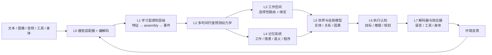

# Seed — Taiji 原生认知架构的运行时

Seed 是训练、评估、部署并托管 **Taiji** 的项目、产品与运行时。Taiji 是一个**原生认知架构**——从在线预测编码机制构建，而不是 Transformer 的包装。内核从**局部预测误差**中学习（无反向传播、无注意力矩阵、无上下文窗口、运行时无教师模型）；在内核之上，Taiji 拥有自己的表征、持续状态、记忆、目标、规划与行动选择，同时在合适处刻意复用成熟算法（embedding、SSM、MoE 式路由、优化器、检索）。Taiji 为之设计的一项关键能力，是**自我进化**——在学习中修订、生长并重组自己的结构（见[结构成长与协作](#结构成长与协作自我进化能力)）。

不吹不黑：仓库同时包含 **Seed 产品外壳**与 **Taiji 研究运行时**。最低层可执行基座是
**Taiji Substrate Kernel v8（TSK-v8）**；当前 M5 工作则在 Taiji 状态与 Workbench 合同之上
评估内容寻址的 K 轴学习与选择路线。这些都是正在工作的研究系统，不是已经发布的通用模型，
也不是完整认知架构（见[现状](#现状)）。

## 语言 / Language

- **简体中文**：本页为中文项目介绍
- **English version**: [README.md](README.md)

[](LICENSE)
[](https://www.python.org/)
[](.github/workflows/ci.yml)

## 架构

### Taiji 是什么

Taiji 的目标是一座**完整的原生认知架构**（合同见 [Taiji 原生架构 v1](plans/active/TAIJI_NATIVE_ARCHITECTURE_V1.md)，需求见 [Taiji 核心目标](plans/active/TAIJI_CORE_REQUIREMENTS.md)）：

- **唯一认知主体。** Taiji 端到端拥有认知状态与决策路径。运行时没有任何 Transformer hidden state、教师 logits 或外部模型替它思考；Seed 是承载/产品运行时，外部模型与工具是环境设施。
- **持续、多时间尺度的状态**，而不是每次请求重新开始——感觉、工作、情景、语义、程序与发展尺度并存。
- **身体 → 真实因果闭环。** 观察变为内部 `PerceptEvent`；行动以 `ActionIntent → WorldAction` 改变环境；真实 `Outcome` 回写世界校准、记忆写入、信用与学习。
- **异质专门化协作，而非单一大而同的网络。** 感受野、时间尺度、学习规则各异的神经群体相互协作；门槛是只有**组合**才能解出的预注册任务（`1 + 1 > 2`）。
- **复用工具箱，拥有心智。** 学习到的 embedding、SSM 块、attention-作为-路由、MoE 式专家、优化器与检索都允许作为机制——不变量是 Taiji 的持续状态、记忆、目标与决策始终由 Taiji 拥有、可保存、可损伤、可替换。

### 分层总览



贯穿 L1–L7 的横向**稳态 / 发展调节**系统，从内部状态驱动好奇、疲劳、压力、睡眠/玩耍与结构预算——而不是来自某个 UI 调度器。

### 记忆与认知状态合同

Taiji 的状态是版本化、可观测的：`PerceptState`、`PredictiveState`、`WorkspaceState`、`WorldState`、`MemoryState`、`GoalState`、`PlanState`、`SelfState`、`HomeostaticState`、`DevelopmentState`、`LearningState`。记忆是多系统——**工作**（当前变量）、**情景**（一次性真实经历）、**语义**（跨经历提炼的稳定概念）与**程序**（技能）——不是上下文窗口、KV cache、一次 RAG 命中，也不是某个 Python 列表。

### 学习：两个平面

1. **发展期训练** —— 批量离线形成感知层级、世界模型、语义记忆与语言器官。使用优化器/蒸馏时显式标记为 `native-assisted`；原生内核同时运行自己的局部 delta 规则（自 2026-08-26 起 `taiji/` 内不再存在 `backward()`）。
2. **终身学习** —— 运行时通过局部预测误差、资格迹、奖励/新颖性调制、情景写入、回放与结构可塑性持续适应，不灾难性遗忘。

### 当前可执行内核（TSK-v8）

`taiji/` 今天运行的是基座内核：原始字节编解码 + 预测 fabric + 分布式情景场原型 + 字节运动器官，接入一个可观测、可 checkpoint 的闭环。不依赖 Transformer，PyTorch 仅作张量执行引擎。更新只发生在固定扇入边上——没有稠密结构掩码、没有注意力矩阵、没有上下文窗口、没有优化器、没有 `backward()`：

```math
u_t^r = \mathrm{Bound}\left(\lambda_u u_{t-1}^r + \alpha_g (D^r)^T e_{t-1}^{r} + \alpha_T \hat a_t^r + \alpha_c c_t^r\right)
```

```math
\Delta D^r=\eta_D\, e_{t-1}^{r}(q_{t-1}^r)^T, \qquad
\Delta T^r=\eta_T\,(a_t^r-T^r q_{t-1}^r)(q_{t-1}^r)^T
```

情景存储是一个共享分布式场：写入一个事件激发一个重叠的 engram 群体 `h`——不追加任何行、键或值：

```math
h^{event}=\phi(Qs+\gamma_e(Aa+Oo+r\rho+Tt+Ee+Pp)), \qquad
\Delta W^{mem}=\eta_m g(h^{event}-W^{mem}h^{cue})(h^{cue})^T
```

（张量形状、更新顺序与状态合同见 [TSK-v8 规范](plans/archive/implementation/TAIJI_SUBSTRATE_KERNEL_V8_SPEC.md)。）

## 能力

项目有一种**对抗式验证文化**：下面的每项能力都由已提交、带病变对照的验证装置测量——固定种子、明确基线（随机 / 冻结父模型 / 简单规则 / 仅哈希）、holdout+retention 只读、全新进程重开 checkpoint 并比对摘要，该失败就如实 `failed`。[M0 五项能力契约](plans/manifests/taiji_foundation_baseline_v1.json) 冻结了"什么算数"。

### 已验证的内核机制（可复现、已提交）

| 能力 | 结果 |
|---|---:|
| 在线字节循环预测（无反向传播） | 0% → **94.12%** 准确率；平均惊奇度 −98.02% |
| 自由生成 | `a → bcdabcda`，全部 8 步精确 |
| 歧义消解（N7） | 100% vs 一阶模型 50% |
| 延迟 / trace 记忆（N8） | 仅 trace 100%；移除 trace 或动态状态 → 50% |
| 无教师长程自由运行（N9） | 128 个动作全部精确 |
| 稀疏迁移（N10） | 相对稠密前向差异 ≤ 2.98e-8；存量为 98.59% |
| 行动信用（N11） | 100% vs 随机 50%、无行动学习 57.5% |
| 情景场一次性写入（M5） | 8 个情景存入一个共享场，零逐事件槽位；召回 87.5% vs 对照 25% |

### 结构成长与协作——自我进化能力

架构的设计目标之一是能修订自身结构（CR-4）。其可执行种子与其余结论一样过 Gate：

- 区域**生长 / split / merge / prune** 与连接剪枝均通过 holdout、预算、trial 往返与逆回滚 Gate；结构提案来自实时预测误差/资源信号，永不来自预先写死的意图表。
- **跨区协作学习器**依据实测的预测误差迁移与资源状态选择显式跨区连接（三 seed 门禁）。

### 能力反证门槛 A0–A9（"聪明"的合同）

每个 Gate 都必须在**未见**数据上、对照显式基线证明机制本身有效；训练分数不能充当通过证据（定义见[架构合同](plans/active/TAIJI_NATIVE_ARCHITECTURE_V1.md#11-能力反证门槛)）：

| Gate | 必须证明 | 进展 |
|---|---|---|
| A0 所有权 | 移除 Seed 决策逻辑后 Taiji 仍能完成认知纵切片 | 合同与纵切片已闭合 |
| A1 学习型抽象 | 可变时长 assembly 迁移到未见组合 | 关系 subgate 闭合；完整 assembly 未闭合 |
| A2 世界状态 | 保持实体/事件并预测干预后的变化 | 狭窄世界 Gate 已闭合 |
| A3 自适应协作 | 异质群体击败任何单一群体 | 工作空间基础已建；完整 Gate 未闭合 |
| A4 情景→语义 | 概念迁移，而非情景复读 | 原型与运行时所有权在；巩固未闭合 |
| A5 稳态调节 | 驱动探索/学习/睡眠，而非 UI 数字 | 原型已门禁；广度未闭合 |
| A6 目标与规划 | 想象 rollout 改善真实成功率 | 单步规划 Gate 已闭合 |
| A7 原生生成 | 内部意图 → 可读语言/工具动作 | 结构化生成已闭合；流畅性在训练中 |
| A8 持续进化 | 旧能力存活；受治理的生长/剪枝 | G 侧课程已闭合；K worker 课程与运行时成长仍开放 |
| A9 具身 | 器官共享世界状态；跨模态迁移 | 合同在；完整 Gate 未闭合 |

### 历史基线：M0–M2

M0 建造了**测量机器**和一个可信零点（`status=failed` 是设计使然）：

- B1 字节/组合预测 —— 在 1 MiB 规模上仍不如 unigram 基线。
- B2 延迟记忆 —— 召回存在，但对 memory-lesion 无因果增益。
- B3 世界转移 / B4 目标驱动行动 —— task 级信号在 pilot 规模通过（world error → ~1e-5、goal success 0.5 → 1.0），尚未到 foundation 规模。
- B5 持续学习 —— 延续已验证；backward transfer 仍为负。

M1 随后在 CPU 上训练这个闭环（课程 F1→F5、三个固定种子、内容寻址数据、原子 `parent/last/best` checkpoint、全新进程只读复核）。原生 association 基座被自己的数据合同判定为不适合 foundation 规模延迟召回，因此一级 **identity key/value 器官**被晋升；其寻址、裁决和折叠 key 的 value 路由分别经过反证并闭合，M1-66c 由此得到正式的 foundation B2 通过结果。

M2-0 完成三 seed 的首轮真实 F1→F4：延迟记忆召回达到 `0.87/0.85/0.87`，世界误差降到约 `3.5e-08`，目标行动成功率达到 `1.0`。M2-1 随后纠正了一项关键测量误区：F2 后看似 F1 崩塌的主因是长期情景记忆反馈泄漏进原始 byte 语言评分，而不是 F2 覆盖了 F1 权重。现在 raw-byte 学习、评分和 native generation 默认隔离长期记忆；将既有三个 child checkpoint 放入全新进程恢复后，F1 holdout 分别为 `4.826/4.931/4.805 BPB`，均优于 `5.942` unigram 基线，B2/B3/B4 同时保持不变。上述结果仍是历史基础基线；完整时间线与证据链接由[唯一执行计划](plans/active/roadmap/03_CURRENT_EXECUTION.md)维护。

### 当前研究路线：R2 原生语言能力主线

当前主线是 R2 结构化语言路径：Taiji 仍是原生认知与输出 owner，回答通过原生 predictive
readout 学习；每个候选都隔离、可保存恢复，并在 family-disjoint 的 train/dev/final episode
上评价。仓库目前还没有形成 L2 对话模型，下面记录的是通向该目标的真实推进，而不是能力宣传。

| 阶段 | 结果 |
|---|---|
| R2-D0/P0 | 结构化 episode 边界、response-only 原生读出、原子 checkpoint 与全新恢复前置已落地 |
| R2-H3.4 | UTF-8 与 end-marker 信用稳定，但未见条件回答的起点和 continuation 尚未迁移 |
| R2-H3.5-A | signed-hash 回答计划候选在 final 前停止：目标几何不迁移，plan bridge 还可能干扰 renderer |
| R2-H3.6 几何 | 三 seed 无训练审计选择 train-whitened native response state + compositional 字符 n-gram；这是目标设计结果，不是语言能力结果 |
| R2-H3.6-A | 版本化 train-only target encoder、训练器接线与保存恢复 smoke 已在 12/8/4 fixture 通过；没有进行能力训练 |
| H3.6-B 前置 | control/treatment 零步前置均通过，effective=276,610≤300,000，parent/恢复/target 血缘检查成立；`training_performed=false` |
| H3.6-B 结果 | 六个 matched dev run 与三组只读 bridge ablation 已完成；seed 方向与非代理序列门失败，final 未读，不追加 epoch |
| R2-H3.7 合同 | 已冻结 4-slot/48维/16-byte phase 分解式回答 workspace；byte error 显式更新 bridge 与当前 slot credit |
| R2-H3.7 前置 | control (273,890) 与 treatment (277,970) 均已通过提交版本的 preflight；`training_performed=false`，三 seed dev 已获准进入 |

权威执行顺序见[当前推进计划](plans/active/roadmap/03_CURRENT_EXECUTION.md)；H3.6 目标合同见
[M5_R2_H3_6_PLAN_TARGET_GEOMETRY_CONTRACT_20260916.md](plans/reference/M5_R2_H3_6_PLAN_TARGET_GEOMETRY_CONTRACT_20260916.md)，
matched 预注册见[M5_R2_H3_6B_MATCHED_RUN_PREREGISTRATION_20260916.md](plans/reference/M5_R2_H3_6B_MATCHED_RUN_PREREGISTRATION_20260916.md)，
最新 plumbing 证据见[taiji_r2_h3_6_target_encoder_smoke_20260916.json](reports/taiji_r2_h3_6_target_encoder_smoke_20260916.json)，
control/treatment 零步证据见[taiji_r2_h3_6b_control_preflight_20260916.json](reports/taiji_r2_h3_6b_control_preflight_20260916.json)与[taiji_r2_h3_6b_treatment_preflight_20260916.json](reports/taiji_r2_h3_6b_treatment_preflight_20260916.json)；H3.7执行合同见[M5_R2_H3_7_FACTORIZED_RESPONSE_WORKSPACE_CONTRACT_20260917.md](plans/reference/M5_R2_H3_7_FACTORIZED_RESPONSE_WORKSPACE_CONTRACT_20260917.md)，提交版本的前置证据见[taiji_r2_h3_7_control_preflight_20260917.json](reports/taiji_r2_h3_7_control_preflight_20260917.json)与[taiji_r2_h3_7_treatment_preflight_20260917.json](reports/taiji_r2_h3_7_treatment_preflight_20260917.json)。

M5 K 轴 scorecard 仍是有效的并行、限定范围机制结果；它不是当前 R2 语言主线，也不代表默认 runtime 晋级。

## 现状

- 已完成并提交：TSK-v8 基座与回归链、结构成长机制 Gate、M0–M2 基础证据、限定范围的 M5
  K 轴 scorecard，以及上文所述的 R2-H3.6-A 目标 plumbing。
- 当前边界：原生语言路线已有结构化训练与恢复证据，但尚未建立 S2/L2 对话能力。K 轴的
  `promotion_gate=false`、`can_promote=false`、`growth_admitted=false` 仍保持诚实边界；不代表默认
  runtime 已挂接 owner，也不代表产品 rollout 已发生。
- 当前主线：执行已获准的 H3.7 三 seed matched dev（control/treatment，各10 epoch、每臂最多120 episodes、final延迟），随后执行冻结的只读 bridge/slot-credit ablation；H3.6-B final 保持未读，Mini 继续后置。
- 诚实边界：这是一个训练中的学习机制原型，**不是**完整的认知架构，尚不是通用语言模型，也不构成任何 AGI 主张。当前 R2 将不可读或不可迁移的回答视为待解决失败，不包装成模型能力。

## 快速开始

```bash
python -m pip install -e ".[dev]"
python scripts/training/verify_taiji_native_v7.py        # 基座回归链
python -m pytest tests -q                                # 当前收集到 1,194 个 Python 测试
```

Seed 运行时兼容 API：

```python
from seed import Seed

model = Seed()
model.learn_bytes(b"abcdabcdabcdabcd", epochs=200)

print(model.score_bytes(b"abcdabcdabcdabcd"))
print(model.generate(b"a", length=8))

checkpoint = model.checkpoint()
restored = Seed.from_checkpoint(checkpoint)
```

历史 foundation 训练入口（CPU）：`scripts/training/train_taiji_foundation.py`、
`train_taiji_memory.py`、`train_taiji_world_action.py`、`train_taiji_joint.py`。

当前 M5 证据 runner 位于 `scripts/training/`：从
`eval_taiji_m5_k_p4_7_capacity_clean_test.py` 到
`eval_taiji_m5_k_p4_13_promotion_course.py`。只读 scorecard reducer 是
`audit_taiji_m5_k_axis_scorecard_v4.py`；运行时必须显式传入 `--report` 输出路径。

## 产品外壳

Seed 以自包含 Windows 桌面构建交付（双入口 `Seed.exe` + `SeedBackend.exe`）：双击即拉起后端、激活原生运行时，并在数秒内于 `http://127.0.0.1:8000` 提供 Web UI——聊天、训练面板、生命状态雷达图、IDE 工作区与 Agent 配置。运行后端前执行 `python -m pip install -e ".[dev,legacy]"`；运行 Qt 桌面壳时再加上 `desktop` extra。开发模式：

```bash
python -m uvicorn api.app:app --host 127.0.0.1 --port 8000   # 后端 + Web UI
python desktop/main.py                                       # 桌面壳
cd frontend && npm ci && npm run dev                         # 前端开发服务器
```

环境开关：`SEED_PORT`（默认 8000）、`SEED_HOST`（默认 127.0.0.1）、`SEED_RUNTIME=1`（启动时激活 Seed 原生运行时）。前端要求 Node 20.19+ 或 22.12+；Docker 用户可执行 `docker compose up --build`。历史 beta 证据见 `reports/seed_public_beta_release_20260823.md`。

## 源码结构

```text
taiji/                  原生架构、器官、记忆、K worker 与 G 选择/求解器
seed/                   Seed 兼容 API 与面向运行时的模型边界
seed_platform/          checkpoint、谱系、Workbench 与产品运行时服务
api/                    FastAPI 后端、训练与 Workbench 路由
frontend/               Vue 产品外壳、合同检查、单元测试与 E2E 冒烟
desktop/                Windows Qt 外壳与 PyInstaller 入口
scripts/training/       验证、foundation 训练与 M5 证据 runner
tests/                  Python 回归、API、运行时与所有权合同测试
reports/                每个里程碑的机器可读、已提交证据
plans/                  active 计划、冻结 manifest 与预注册研究合同
```

## 许可证

Apache License 2.0，见 [LICENSE](LICENSE)。
