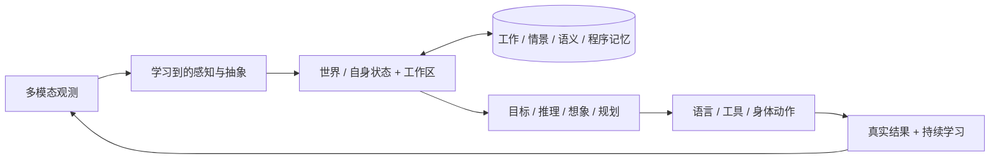

# Seed — Taiji 原生认知架构的运行时

一个在**字节层面做预测编码**的内核，**在线**从局部预测误差中学习——没有反向传播、没有注意力矩阵、没有上下文窗口、没有教师模型。所有更新都沿稀疏固定扇入突触传播，情景记忆是一个共享的分布式场，为每个事件分配 **零个独立槽位**。

这个项目与众不同的地方不在野心，而在**验证纪律**。本 README 中的每一个数字都来自已提交的、带病变对照（lesion control）的验证装置：固定种子、明确的对照基线（随机 / 冻结父模型 / 简单规则 / 仅哈希）、holdout 与 retention 保持只读、在**全新进程**中重新加载 checkpoint 并比对内容摘要。失败就如实记录为失败。

## 语言 / Language

- **简体中文**：本页为中文项目介绍

- **English version**: [README.md](README.md)

[](LICENSE)
[](https://www.python.org/)
[](.github/workflows/ci.yml)

## 现状（不加粉饰）

最近进展：**2026-09-03 · 1044 次提交 · M0 已完成，M1 进行中（M1-65）**。

| 阶段                 | 结论                                                                                                                               |
| ------------------ | -------------------------------------------------------------------------------------------------------------------------------- |
| 基座内核（TSK-v8）       | 可复现：字节循环准确率 **0% → 94.12%**，惊奇度 **−98.02%**，自由生成逐位正确，固定种子并已提交                                                                    |
| M0 五项能力基线          | **已完成并被采信为可信零点** —— 测量链端到端成立（checkpoint preflight 通过、全部对照接线）；**五项能力无一被证明成立**，失败的项一律如实记录 `failed`                                 |
| M1 foundation 训练管线 | 已建成并运行：F1–F5 课程、三个种子、内容寻址数据分区、`parent/last/best` 原子检查点、全新进程只读评估                                                                  |
| M1 记忆能力            | identity 器官 v2 已晋升为**一级可训练 key/value 记忆器官**（15/15 门禁）——随后 **foundation 规模 B2 被诚实判定：记忆能力尚未成立**；根因已定位（干扰下寻址键丢失）；验收探针已提交，当前为红，机制修复中 |

架构方向不变：**Taiji 是原生认知架构，不是 Transformer 的包装**（不 import `transformers` 与旧 `neuroplex` 运行时，PyTorch 仅作张量执行引擎）。当前模型是**学习机制原型**——不是完整的认知架构，不是语言模型，也不构成任何 AGI 主张。今天输出乱码是预期中的内核行为。

## 为什么这里的数字可信

1. **每个结论都有病变对照。** 一个结果只有在「去掉该机制（记忆 / 行动信用 / trace / identity 器官）后分数确实塌掉」才算数；这些消融臂是提交内验证装置的一部分，不是事后补的。
2. **装置无法替模型作弊。** holdout/retention 分区在训练报告与独立重开进程之间逐字节一致（`holdout_updates = 0`、`checkpoint_read_only = true`、摘要匹配）；置换零分布守卫课程本身无捷径。
3. **失败也是产品的一部分。** 台账如实记录：一个"可信但未通过"的 foundation 基线（`can_promote = false`）、一个被自己数据契约**判定为不适合并拒绝**的候选记忆基座、以及一个被更大规模判定推倒的已晋升器官——并且都用**三次连续的反证探针**锁定了机制层面，而不是超参数层面。
4. **单一事实源治理。** `plans/active/roadmap/03_CURRENT_EXECUTION.md` 是唯一执行计划、唯一"下一步"权威；历史计划编号只是追溯标签。本 README 的每个里程碑都能一路追溯到 `reports/` 里带编号、带 JSON 的报告。

## 架构一览



**不变量：Taiji 拥有认知状态与决策路径。** qwen/provider（作为教师）、任何 Transformer、Legacy 运行时或 Skill/MCP 产物都不得成为运行时的认知主体。成熟的算法（优化器、embedding、蒸馏）只在合适处、在 provenance 约束与 holdout 隔离下被复用——"站在巨人肩膀上"但带双重边界，不是移植。

## Transformer 做的事 vs 本内核的做法

| Transformer               | Taiji 原生内核                |
| ------------------------- | ------------------------- |
| tokenizer + 学到的 embedding | 256 个原始字节感受器 + 边界感受器      |
| self-attention            | 稀疏互预测与循环转移                |
| KV cache / 外部检索           | 一个共享 engram 场，无逐事件 K/V 槽位 |
| 全局反向传播                    | 局部预测 / 状态 / 运动 / 记忆增量     |
| 自回归解码                     | 运动字节经同一感受器反馈回输入           |

## 已验证结果

### 基座内核（TSK-v8）—— 可复现、已提交

固定两区域 `[64, 48]` 字节循环基准（seed 7）：

| 指标           |                                   结果 |
| ------------ | -----------------------------------: |
| 活跃学习参数       |                               83,841 |
| 字节循环准确率      |                          0% → 94.12% |
| 平均惊奇度        |         5.4041 → 0.1069（**−98.02%**） |
| 自由生成         |               `a → bcdabcda`（全部八步正确） |
| 稀疏 vs 稠密前向差异 |      ≤ 2.98e-8（N10）；存量为稠密等价量的 98.59% |
| N7 歧义流       |                完整模型 100% vs 一阶模型 50% |
| N8 延迟 trace  |  仅 trace 100%；移除 trace 或全部动态状态 → 50% |
| N9 自由运行      |                 128 次运动动作、无教师强制、全部精确 |
| N11 行动信用     |           100% vs 随机 50%、无行动学习 57.5% |
| M5 情景场       | 8 个一次性情景、零逐事件槽位；动作召回 87.5% vs 对照 25% |

机制级决策以 M6 **种子面板**（12 个种子）为准而非单次运行；基线永远从干净工作区重跑，而不是从已提交报告里读。

### M0 —— 一个可信的零点（五项能力，如实失败）

M0 建造的是测量机器，不是能力本身（总体 `status = failed`、`can_promote = false`，这是设计使然）。它的交付是：这个结论现在是**可信的**——

- **Checkpoint preflight 通过**：保存 → 关闭进程 → 在新解释器中恢复 → 下一步预测与摘要逐位一致 → 再次保存子 checkpoint。

- **契约冻结**：`plans/manifests/taiji_foundation_baseline_v1.json` 固定五项能力、四类对照、三个种子、四个分区、样本下限与 holdout 只读规则。泄漏与副作用测试必须先红，才允许写 evaluator。

- **B1 序列预测** —— `failed`：最差 seed 6.497 BPB vs unigram 5.942，真实中文语料（train `1,048,576` / holdout `131,072` / retention `131,072`）。

- **B2 延迟记忆** —— `failed`：0.75 未超过 memory-lesion 臂，无归因的因果增益。

- **B3 转移 / B4 行动信用** —— task 级信号通过但仅为 smoke 样本量，不具晋升力。

- **B5 持续学习** —— `failed`：最差 backward transfer −0.244；phase-B 延续本身已验证（无隐藏重初始化）。

零点可信之后，计划刻意停止扩张外围（插件、UI、门禁），用失败曲线直接驱动训练课程。

### M1 —— 第一次真正的联合训练，三个种子

完整 foundation 管线，课程拆分 **F1（感知）→ F2（记忆）→ F3（世界/行动）→ F4（联合）→ F5（晋级）**，全部落在同一条 checkpoint 谱系：

- **F1 字节预测**：holdout BPB 各 seed `9.063→6.384`、`8.738→6.395`、`9.397→6.246`（pilot），扩展至 `1,048,576` 字节后 → `5.3649→4.8648` 等。

- **F3 世界/行动**：world error `1.8871 → ~1e-5`；goal success `0.5 → 1.0`；消融 outcome credit 后回落到 `0.5`。

- **F4 联合训练**：四个目标合入同一 checkpoint —— 序列 BPB `8.0056 → ~5.2`、记忆召回 `0.5 → 0.63+`、world error → `~1e-5`、goal success `1.0`，retention 同步改善。

- 装置发现并修复了一个真实恢复缺陷：`SparseSynapses.load_payload()` 中 1-ulp 的 float32 舍入会在恢复时静默改写权重；已用容差幂等边界与回归测试锁死（提交 `ab4b079`）。

- 全量覆盖晋级审计：三个种子、`1,048,576 / 1,000 / 1,000 / 1,000` 样本，训练报告与独立 eval-only 在每项指标与 checkpoint 摘要上**逐字节一致**——并在记忆退化时如实给出 `blocked`。

两时间尺度学习策略（诚实、不教条）：发展期离线学习允许在**可微**模块上挂成熟优化器/蒸馏；运行期突触保持局部预测误差学习。两者写入同一版本化 checkpoint，但可分别消融。

### M1 记忆 —— 一个先晋升、再被诚实推翻的器官

- **原生情景关联**先被判定**不适合作为训练承载层**：数据契约（`MemoryLearningExample`：稳定 `cue_key` → 相互独立的 `action` / `outcome` value、逐分区 provenance 审计）显示逐行绑定边际为负，且负对照行为相同（`reports/taiji_m1_62_*`）。

- **identity 器官 v2** 随后晋升为默认开启的一级可训练 key/value 记忆器官（15/15 门禁；reward 调制的三因子写入；参数 `171,561 → 311,081`，`+139,520` 的器官份额显式登记在预算中而非隐藏）。翻默认开关暴露并修复了四处真实缺陷——包括一处**奖励盲写入**，它会把错误动作绑得与正确动作一样强。

- foundation 规模 B2 在 manifest 下限（`1,000/200/200`，三 seed 合计约 2,809 CPU 秒）上给出诚实判决：**记忆能力尚未成立**。identity-lesion 与完整 Taiji 在三个 seed 上逐位相同；读路径与"什么都没写"在统计上不可区分；置换零分布证明课程无捷径。

- **三次连续反证探针**锁定根因：容量不是问题（128 → 4096 槽位逐位零变化）；课程难度不是问题（仅 1 个干扰符号就足以破坏寻址）；问题在**干扰下寻址键丢失**——写入基与干扰后的读出基余弦 `≈ 0.098`，而匹配阈值为 `0.9`，因为器官以 fabric 的**瞬时活动状态**作为寻址键，干扰会将其冲毁。

- 唯一下一步（M1-65）已写死在常驻验收探针里：断言"≥1 个干扰符号后，写入基与读出基余弦 ≥ 阈值"——今天为红（`min 0.047`），机制必须让它转绿，之后才能用**原样的** B2 evaluator 重跑。这把"可修复的寻址"与"好看的准确率"解耦，小课程满分再也无法伪装成 foundation 级胜利。

## 项目范围

**Taiji** 是原生认知架构与模型。**Seed** 是训练、评估、部署并托管 Taiji 的项目、产品与运行时。Taiji 围绕学习到的感知、世界状态、工作区、记忆、目标、推理、规划与生成进行重构，并在合适处复用成熟算法——而不是从原始 one-hot 机制重建智能。

## 命名

| 名称                   | 含义                                                              |
| -------------------- | --------------------------------------------------------------- |
| **Seed**             | 项目、产品、发行物与运行时；包名 `seed`                                         |
| **Taiji**            | 完整的原生认知架构与模型；目标包 `taiji/`                                       |
| **TSK-v8**           | 当前可执行的字节/fabric/记忆/运动研究内核与兼容线                                   |
| **Legacy NeuroPlex** | `neuroplex/` 中冻结的 Transformer 基线；仅为可复现与同预算对比而保留；永不进入 Taiji 认知路径 |

## 快速开始

```bash
python -m pip install -e ".[dev]"
python scripts/training/verify_taiji_native_v7.py        # 基座回归链
python -m pytest tests -q                                # 900+ 已提交测试
```

Seed 运行时兼容 API：

```python
from seed import Seed

model = Seed()
model.learn_bytes(b"abcdabcdabcdabcd", epochs=200)

print(model.score_bytes(b"abcdabcdabcdabcd"))
print(model.generate(b"a", length=8))

checkpoint = model.checkpoint()
restored = Seed.from_checkpoint(checkpoint)
```

训练入口（M1，CPU）：`scripts/training/train_taiji_foundation.py`、`train_taiji_memory.py`、`train_taiji_world_action.py`、`train_taiji_joint.py`（当前课程与唯一下一步见 `plans/active/roadmap/03_CURRENT_EXECUTION.md` §6 —— 唯一权威）。

## 产品外壳

Seed 以自包含 Windows 桌面构建交付（双入口 `Seed.exe` + `SeedBackend.exe`）：双击即拉起后端、激活原生运行时，并在数秒内于 `http://127.0.0.1:8000` 提供 Web UI——聊天、训练面板、生命状态雷达图、IDE 工作区与 Agent 配置。开发模式：

```bash
python -m uvicorn api.app:app --host 127.0.0.1 --port 8000   # 后端 + Web UI（提供 frontend/dist）
python desktop/main.py                                         # 桌面壳（窗口 + 后端 + WebSocket 8765）
cd frontend && npm run dev                                     # 前端开发服务器
```

环境开关：`SEED_PORT`（默认 8000）、`SEED_HOST`（默认 127.0.0.1）、`SEED_RUNTIME=1`（启动时激活 Seed 原生运行时）。历史 beta 证据见 `reports/seed_public_beta_release_20260823.md` 与 `reports/`。

产品外壳记录的是**运行时**，不是能力：UI 刻意不被允许夸大模型（视觉美化只能表达真实状态）。能力在下面按 model-first 构建。

## 可复现与证据规则

- 固定种子集（默认 `[11, 29, 47]`，机制决策用 12-seed 面板）；单个有利种子永不晋升。

- 评估期 evaluator 不触碰 provider、前端、MCP executor 与训练接口；断言 `holdout_updates = 0`、`retention_updates = 0`。

- 每个晋升产物保持 parent/child 谱系、内容摘要族谱、可审计的参数预算（planned = active）与全新进程只读复核。

- 序列化了 `taiji.*` 名字的历史 checkpoint 经 scoped `neuroplex.legacy_checkpoint` 兼容工具加载；import NeuroPlex 不再遮蔽原生 `taiji` 包。Legacy 依赖仅在复现该基线时安装：`python -m pip install -e ".[legacy]"`。

## 源码结构

```text
taiji/                      原生认知架构（不 import seed/neuroplex/transformers）
├── fabric.py               预测性循环 tick
├── sparse.py               固定扇入突触与局部更新
├── memory.py               分布式情景编码、补全与回读
├── identity_organ.py       一级 key/value 记忆器官（M1-63 后默认开启）
├── organs.py               原始字节感受器、稀疏感受器库、奖励感知运动器官
├── foundation_tasks.py     B1–B5 能力适配器（M0 契约）
├── foundation_training.py  联合 F1–F5 训练运行、checkpoint、谱系
└── model.py                observe / learn / score / generate / checkpoint

scripts/training/           verify_* 回归链、train_taiji_* 入口、eval_taiji_m1_*
tests/taiji_native/         内核回归与所有权契约（全仓 900+ 测试）
plans/active/roadmap/03_CURRENT_EXECUTION.md    唯一执行计划与下一步权威
reports/                    每个里程碑的编号、已提交证据
```

## 许可证

Apache License 2.0，见 [LICENSE](LICENSE)。
